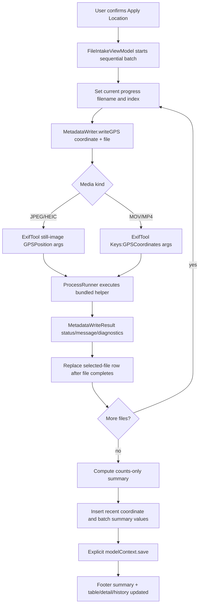

# Phase 04: Batch Results, Video, and History - Research

**Researched:** 2026-05-18  
**Domain:** macOS SwiftUI batch progress/results, ExifTool MOV/MP4 GPS writes, SwiftData recent state/history  
**Confidence:** HIGH for local architecture, SwiftData save/model boundaries, and ExifTool tag availability; MEDIUM for cross-app video compatibility because MOV/MP4 location metadata consumers vary.

<user_constraints>
## User Constraints (from CONTEXT.md)

### Locked Decisions

### Batch Progress Without Cancellation
- **D-01:** Do not add active cancellation in Phase 4.
- **D-02:** Do not defer cancellation as future work; treat cancellation as intentionally dropped from the product scope for now.
- **D-03:** Do not add a Cancel button, cancellation command, or cancelled file state.
- **D-04:** Rows should update only after each file completes, preserving the current selected-files table as the result surface.
- **D-05:** While the sequential batch is running, the footer should show the currently writing filename and count.
- **D-06:** Footer progress copy should be filename-first, for example: `Writing IMG_2042.HEIC (3 of 12)`.

### Result Review Depth
- **D-07:** Keep the existing selected-files table as the primary result surface after a batch.
- **D-08:** Selecting a row should show that file's result message in the existing bottom-left detail panel.
- **D-09:** Warning and failure rows may expose collapsed technical diagnostics when diagnostic detail exists.
- **D-10:** Success rows should stay quiet and should not expose technical diagnostics.
- **D-11:** Completed batch summaries should remain counts-only, for example: `9 updated, 2 warnings, 1 failed.`

### Video Best-Effort Behavior
- **D-12:** Do not hard-code the exact MOV/MP4 ExifTool tag set in this context. Phase 4 research must choose the minimal tag set for best-effort QuickTime-compatible location writes.
- **D-13:** If ExifTool exits cleanly for a MOV or MP4 write, show success with the same user-facing success message style as images, such as `GPS metadata updated.`
- **D-14:** Do not add extra compatibility caveats to successful video rows.
- **D-15:** MOV/MP4 rows should show warnings or failures only when the helper reports warnings or failures.
- **D-16:** MOV and MP4 should share the same user-facing behavior and copy by default.
- **D-17:** Research and planning may split MOV and MP4 arguments or result handling if ExifTool behavior differs by container.

### Recent Coordinates and Batch History
- **D-18:** Recent coordinates should appear in the coordinate panel near the existing search/manual controls.
- **D-19:** Recent coordinate labels should use the selected place name when available, otherwise formatted coordinates.
- **D-20:** Custom naming and pinned favorites are out of scope for Phase 4.
- **D-21:** Recent batch runs should appear in a dedicated compact history section below the selected-file detail/result area.
- **D-22:** Each batch history entry should show timestamp, coordinate label, total file count, and success/warning/failure counts.
- **D-23:** Selecting a batch history entry should support reusing that run's coordinate in the coordinate panel.
- **D-24:** Selecting a batch history entry must not restore previous files or previous per-file results into the active table.
- **D-25:** SwiftData should persist recent coordinate records and compact batch summaries only: coordinate label/value, timestamp, total file count, and success/warning/failure counts.
- **D-26:** SwiftData must not persist media contents, per-file result history, file bookmark data, or enough information to reconnect prior files in Phase 4.
- **D-27:** Correctness-sensitive SwiftData writes must be explicitly saved rather than relying on autosave timing.

### the agent's Discretion
- Planner may choose the exact SwiftData model type names, fetch/query boundaries, retention count for recent coordinates/history, and view decomposition, as long as the decisions above and existing SwiftUI architecture are preserved.
- Planner may choose the exact collapsed diagnostic disclosure UI in the detail panel.
- Researcher and planner must decide the exact MOV/MP4 ExifTool arguments from current ExifTool documentation and behavior, not from this context alone.

### Deferred Ideas (OUT OF SCOPE)
- None. Cancellation was explicitly dropped from scope and should not be treated as a deferred future feature.
</user_constraints>

<phase_requirements>
## Phase Requirements

| ID | Description | Research Support |
|----|-------------|------------------|
| BATCH-02 | Originally cancellation; superseded by context override. | Do not implement active cancellation UI, command, state, or future deferral. Existing `FoundationProcessRunner` may retain its task-cancellation handler as internal infrastructure only. [VERIFIED: 04-CONTEXT.md] [VERIFIED: codebase grep] |
| BATCH-03 | User can see batch progress while writes are running. | Add main-actor `currentMetadataBatchProgress` or equivalent state updated before each awaited write; footer renders `Writing <filename> (<index> of <total>)`. [VERIFIED: 04-CONTEXT.md] [VERIFIED: codebase grep] |
| BATCH-04 | User can see per-file success, warning, and failure results after a batch. | Existing selected-file table shows `latestResult`; detail panel already shows `latestMessage`. Extend selected-file detail with `diagnosticDetail` for warning/failure disclosures only. [VERIFIED: codebase grep] |
| META-03 | Best-effort QuickTime-compatible location metadata for MOV. | Use ExifTool `-Keys:GPSCoordinates=<lat>, <lon>` for MOV so the write targets QuickTime Keys `location.ISO6709`, which Apple documents as the QuickTime location metadata key. [CITED: https://exiftool.org/TagNames/QuickTime.html] [CITED: https://developer.apple.com/documentation/avfoundation/avmetadatakey/quicktimemetadatakeylocationiso6709] |
| META-04 | Best-effort QuickTime-compatible location metadata for MP4. | Use the same `-Keys:GPSCoordinates=<lat>, <lon>` argument strategy for MP4 unless host sample verification finds container-specific behavior requiring split handling. [CITED: https://exiftool.org/TagNames/QuickTime.html] [VERIFIED: 04-CONTEXT.md] |
| PERSIST-01 | User can reuse recent coordinates saved by the app. | Add a SwiftData-backed recent coordinate store exposed in the coordinate panel; selecting one writes into the existing `CoordinateSelectionViewModel.selectedCoordinate`. [VERIFIED: 04-CONTEXT.md] [VERIFIED: codebase grep] |
| PERSIST-02 | User can view recent batch runs with timestamp, coordinate, and success/warning/failure counts. | Add compact SwiftData `BatchRun` summaries below the detail/result area; do not restore files or per-file results from history. [VERIFIED: 04-CONTEXT.md] |
| PERSIST-03 | SwiftData stores app state/history/preferences only, not media contents. | Persist recent coordinate and compact batch summary values only; do not persist `URL`, bookmark data, media contents, or per-file result records. [VERIFIED: 04-CONTEXT.md] [VERIFIED: REQUIREMENTS.md] |
| PERSIST-04 | Correctness-sensitive SwiftData writes are explicitly saved. | Insert/update SwiftData models after batch completion and call `try modelContext.save()`; Apple documents `ModelContext.save()` as persisting pending context changes. [CITED: https://developer.apple.com/documentation/swiftdata/modelcontext/save%28%29] |
</phase_requirements>

## Summary

Phase 4 should be planned as a narrow enhancement of the existing Phase 3 workflow: keep one sequential batch loop, add footer progress before each file write, preserve row updates after each file completes, expose warning/failure diagnostics in the existing detail panel, replace the video-deferred branch with a best-effort QuickTime Keys write, and persist only compact recent-coordinate/batch-summary values in SwiftData. [VERIFIED: 04-CONTEXT.md] [VERIFIED: codebase grep]

**Primary recommendation:** Use `-overwrite_original`, `-Keys:GPSCoordinates=<latitude>, <longitude>`, and the file path as separate ExifTool arguments for MOV/MP4, while adding SwiftData `RecentCoordinate` and `BatchRunSummary` models plus explicit `modelContext.save()` after correctness-sensitive inserts. [CITED: https://exiftool.org/TagNames/QuickTime.html] [CITED: https://developer.apple.com/documentation/swiftdata/modelcontext/save%28%29] [VERIFIED: codebase grep]

Do not plan cancellation despite BATCH-02 wording in older requirement and roadmap files; `04-CONTEXT.md` is the controlling source and explicitly drops cancellation from product scope for now. [VERIFIED: 04-CONTEXT.md]

## Project Constraints (from AGENTS.md)

- Target macOS app code with Swift 6.2 or later, strict Swift concurrency, SwiftUI, and `@Observable` shared state. [VERIFIED: AGENTS.md] [VERIFIED: project.pbxproj grep]
- `@Observable` classes must be `@MainActor` unless default actor isolation covers them; this project also sets `SWIFT_DEFAULT_ACTOR_ISOLATION = MainActor`. [VERIFIED: AGENTS.md] [VERIFIED: project.pbxproj grep]
- Do not introduce third-party Swift frameworks without asking first; Phase 4 should use SwiftUI, SwiftData, Foundation, and the already-bundled ExifTool helper. [VERIFIED: AGENTS.md] [VERIFIED: codebase grep]
- Prefer async/await and structured concurrency; do not add GCD or untracked per-file `Task {}` writes. [VERIFIED: AGENTS.md] [VERIFIED: .agents/skills/swift-concurrency-pro/SKILL.md]
- SwiftUI buttons need text labels and system images where applicable; do not use `onTapGesture()` for normal commands. [VERIFIED: AGENTS.md] [VERIFIED: .agents/skills/swiftui-pro/SKILL.md]
- Break new models, views, and services into separate Swift files under feature folders rather than adding multiple major types to one file. [VERIFIED: AGENTS.md] [VERIFIED: .agents/skills/swiftui-pro/SKILL.md]
- Write unit tests for core application logic; UI tests only if unit tests cannot cover behavior. [VERIFIED: AGENTS.md]
- If SwiftLint is installed, keep it clean before commit. [VERIFIED: AGENTS.md]
- Host-side closeout must include exact `xcodebuild`, app launch, and focused UI smoke steps because VM-only verification is insufficient for SwiftUI/MapKit/Xcode behavior. [VERIFIED: AGENTS.md] [VERIFIED: docs/host-xcodebuild-verification-boundary.md]

## Architectural Responsibility Map

| Capability | Primary Tier | Secondary Tier | Rationale |
|------------|--------------|----------------|-----------|
| Batch progress display | MainActor view model / SwiftUI footer | Metadata writer | The file-intake view model owns selected-file order and batch state; the footer already renders batch status. [VERIFIED: codebase grep] |
| Per-file result rows | MainActor view model | Metadata writer | `FileIntakeViewModel.applyMetadata` already replaces immutable `SelectedMediaFile` rows after each `MetadataWriteResult`. [VERIFIED: codebase grep] |
| Diagnostic detail display | SwiftUI detail panel | MainActor view model | `MetadataWriteResult` already carries `diagnosticDetail`; the detail panel needs selected-row access and a disclosure UI for warning/failure rows. [VERIFIED: codebase grep] |
| MOV/MP4 write arguments | Metadata service | ExifTool process runner | `ExifToolArgumentBuilder` owns tag arguments; `ExifToolMetadataWriter` already has the narrow `.mov/.mp4` replacement point. [VERIFIED: codebase grep] |
| Recent coordinate reuse | SwiftData + coordinate view model | SwiftUI coordinate panel | Persistence stores compact coordinate values; selecting a recent coordinate should update the same selected-coordinate state used by Apply Location. [VERIFIED: 04-CONTEXT.md] [VERIFIED: codebase grep] |
| Batch history | SwiftData + file-intake UI | MainActor view model | History stores compact counts after batch completion and renders below the existing detail/result area without reconnecting files. [VERIFIED: 04-CONTEXT.md] |

## Standard Stack

No new package installation is recommended for Phase 4. [VERIFIED: AGENTS.md]

### Core

| Library / Tool | Version | Purpose | Why Standard |
|----------------|---------|---------|--------------|
| Swift / SwiftUI | Swift 6.2 project setting | Main app state and UI | Existing Xcode project uses Swift 6.2, complete strict concurrency, default MainActor isolation, and SwiftUI views. [VERIFIED: project.pbxproj grep] |
| SwiftData | Apple platform framework | Recent coordinates and compact batch history | Project stack chooses SwiftData for app state/history and Apple documents model persistence through `ModelContext`. [VERIFIED: AGENTS.md] [CITED: https://developer.apple.com/documentation/swiftdata/preserving-your-apps-model-data-across-launches] |
| Swift Testing | Existing test target | Unit tests for batch progress, diagnostics, argument building, and persistence stores | Current tests import `Testing` and use `@Test`; no separate test framework should be added. [VERIFIED: codebase grep] |
| ExifTool | Bundled 13.58 | Metadata writes for still images and videos | Current app bundles ExifTool 13.58; ExifTool docs list QuickTime `Keys:GPSCoordinates` as writable. [VERIFIED: local `GPSMetadataEditor/Resources/ExifTool/exiftool -ver`] [CITED: https://exiftool.org/TagNames/QuickTime.html] |

### Supporting

| Component | Version | Purpose | When to Use |
|-----------|---------|---------|-------------|
| Foundation `Process` | Apple Foundation | Execute bundled ExifTool through executable URL and argument array | Keep using the existing `ProcessRunner` abstraction for all helper execution. [VERIFIED: codebase grep] |
| SwiftUI `ProgressView` | Apple SwiftUI | Optional compact determinate progress indicator | Use only if it fits the locked dense footer; `ProgressView(value:)` supports determinate progress. [CITED: https://developer.apple.com/documentation/SwiftUI/ProgressView] [VERIFIED: 04-CONTEXT.md] |
| SwiftUI `DisclosureGroup` | Apple SwiftUI | Collapsed diagnostics in detail panel | Use for warning/failure diagnostic detail if planner chooses a standard disclosure control. [ASSUMED] |

### Alternatives Considered

| Instead of | Could Use | Tradeoff |
|------------|-----------|----------|
| `Keys:GPSCoordinates` | Unqualified `GPSCoordinates` | ExifTool defaults new QuickTime tags to preferred locations such as ItemList before Keys, but Phase 4 wants QuickTime-compatible Apple-style location metadata; Keys maps directly to `location.ISO6709`. [CITED: https://exiftool.org/TagNames/QuickTime.html] [CITED: https://developer.apple.com/documentation/avfoundation/avmetadatakey/quicktimemetadatakeylocationiso6709] |
| Compact SwiftData models | Persist per-file result history/bookmarks | Context explicitly forbids enough persisted information to reconnect previous files in Phase 4. [VERIFIED: 04-CONTEXT.md] |
| New results drawer | Existing table/detail panel | Context locks the selected-files table and bottom-left detail panel as the result surface. [VERIFIED: 04-CONTEXT.md] |

**Installation:** none. [VERIFIED: AGENTS.md]

## Package Legitimacy Audit

No npm, PyPI, crates.io, or SwiftPM package is recommended for Phase 4, so the package legitimacy gate is not applicable. [VERIFIED: AGENTS.md]

ExifTool is already vendored as a bundle resource and was verified locally as version 13.58. [VERIFIED: local `GPSMetadataEditor/Resources/ExifTool/exiftool -ver`]

## Architecture Patterns

### System Architecture Diagram



### Recommended Project Structure

```text
GPSMetadataEditor/
├── Features/
│   ├── BatchHistory/
│   │   ├── Models/
│   │   │   ├── BatchRunSummary.swift
│   │   │   └── RecentCoordinate.swift
│   │   ├── Services/
│   │   │   └── BatchHistoryStore.swift
│   │   └── Views/
│   │       ├── BatchHistorySection.swift
│   │       └── RecentCoordinatesView.swift
│   ├── FileIntake/
│   │   └── Views/
│   │       └── FileDetailPanel.swift
│   └── MetadataWriting/
│       └── ExifToolArgumentBuilder.swift
└── GPSMetadataEditorApp.swift
```

Keep view-model state changes in existing `FileIntakeViewModel` and `CoordinateSelectionViewModel` unless planner finds a strong reason to add a small persistence coordinator. [VERIFIED: codebase grep] [ASSUMED]

### Pattern 1: Sequential Progress State

**What:** Store current batch progress as a value on `FileIntakeViewModel`, update it before each awaited write, and clear it in `defer`. [VERIFIED: codebase grep]  
**When to use:** Use for BATCH-03 only; do not create cancellation state or a cancel command. [VERIFIED: 04-CONTEXT.md]

```swift
struct MetadataBatchProgress: Equatable, Sendable {
    let filename: String
    let completedCount: Int
    let totalCount: Int

    var footerText: String {
        "Writing \(filename) (\(completedCount + 1) of \(totalCount))"
    }
}
```

### Pattern 2: Video Argument Builder Branch

**What:** Replace the current `.mov/.mp4` unsupported branch with a QuickTime Keys GPS argument path. [VERIFIED: codebase grep]  
**When to use:** Use for both MOV and MP4 unless host verification shows different behavior. [VERIFIED: 04-CONTEXT.md]

```swift
[
    "-overwrite_original",
    "-Keys:GPSCoordinates=\(coordinate.latitude), \(coordinate.longitude)",
    file.url.path(percentEncoded: false),
]
```

Source: ExifTool QuickTime docs list QuickTime Keys `location.ISO6709` as writable `GPSCoordinates`; Apple documents the QuickTime location ISO 6709 key as geographic point location coordinates. [CITED: https://exiftool.org/TagNames/QuickTime.html] [CITED: https://developer.apple.com/documentation/avfoundation/avmetadatakey/quicktimemetadatakeylocationiso6709]

### Pattern 3: Explicit SwiftData Save After Correctness-Sensitive Inserts

**What:** Insert compact records, prune retention if needed, and call `try modelContext.save()` in the same main-actor persistence boundary. [CITED: https://developer.apple.com/documentation/swiftdata/modelcontext/save%28%29] [VERIFIED: .agents/skills/swiftdata-pro/references/core-rules.md]

```swift
modelContext.insert(recentCoordinate)
modelContext.insert(batchRunSummary)
try modelContext.save()
```

Apple documents that inserting a model lets SwiftData track it and that `save()` persists pending changes; the local SwiftData skill also warns not to rely on autosave for correctness-sensitive writes. [CITED: https://developer.apple.com/documentation/swiftdata/preserving-your-apps-model-data-across-launches] [VERIFIED: .agents/skills/swiftdata-pro/references/core-rules.md]

### Anti-Patterns to Avoid

- **Planning cancellation anyway:** BATCH-02 is overridden; do not add a Cancel button, cancellation state, or deferred cancellation ticket. [VERIFIED: 04-CONTEXT.md]
- **Persisting file URLs/bookmarks/history details:** This would violate D-26 because the app could reconnect old files. [VERIFIED: 04-CONTEXT.md]
- **Unqualified video GPS write by default:** ExifTool may create QuickTime tags in preferred locations other than Keys; target `Keys:GPSCoordinates` for Apple QuickTime location compatibility. [CITED: https://exiftool.org/TagNames/QuickTime.html]
- **Showing diagnostics for success rows:** D-10 says success rows stay quiet. [VERIFIED: 04-CONTEXT.md]
- **Crossing actors with SwiftData model instances:** Local SwiftData rules say `ModelContext` and model instances must not cross actor boundaries; pass values or persistent identifiers if cross-actor work appears. [VERIFIED: .agents/skills/swiftdata-pro/references/core-rules.md]

## Don't Hand-Roll

| Problem | Don't Build | Use Instead | Why |
|---------|-------------|-------------|-----|
| MOV/MP4 QuickTime location encoding | Custom ISO 6709 writer or AVFoundation exporter | ExifTool `Keys:GPSCoordinates` | ExifTool already maps this tag to QuickTime Keys `location.ISO6709`; Apple documents that key for QuickTime location metadata. [CITED: https://exiftool.org/TagNames/QuickTime.html] [CITED: https://developer.apple.com/documentation/avfoundation/avmetadatakey/quicktimemetadatakeylocationiso6709] |
| Persistence store | JSON/plist side file | SwiftData `@Model` records | Project stack and requirements choose SwiftData for app state/history. [VERIFIED: AGENTS.md] [VERIFIED: REQUIREMENTS.md] |
| Progress engine | Parallel task pool | Existing sequential async loop | Phase 3 already has sequential writes; Phase 4 progress needs one current filename/count, not parallel coordination. [VERIFIED: codebase grep] [VERIFIED: 04-CONTEXT.md] |
| Diagnostic UI | Custom drawer/report export | Existing detail panel plus disclosure | Context locks result review to the table and bottom-left detail panel. [VERIFIED: 04-CONTEXT.md] |

**Key insight:** Phase 4 adds visibility and small durable state around an already working sequential writer; the risky work is choosing the correct video tag target and not accidentally expanding persistence or cancellation scope. [VERIFIED: 04-CONTEXT.md] [CITED: https://exiftool.org/TagNames/QuickTime.html]

## Common Pitfalls

### Pitfall 1: Treating BATCH-02 As Active Scope
**What goes wrong:** Planner adds cancel UI/state because `.planning/REQUIREMENTS.md` and `.planning/ROADMAP.md` still mention cancellation. [VERIFIED: REQUIREMENTS.md] [VERIFIED: ROADMAP.md]  
**Why it happens:** The newer `04-CONTEXT.md` intentionally overrides those older artifacts. [VERIFIED: 04-CONTEXT.md]  
**How to avoid:** Add a planning task only to preserve existing internal process-cancellation behavior where already present; do not expose it. [VERIFIED: 04-CONTEXT.md] [VERIFIED: codebase grep]  
**Warning signs:** Any planned `Cancel` button, `.cancelled` status, `cancelBatch()` API, or "defer cancellation" note. [VERIFIED: 04-CONTEXT.md]

### Pitfall 2: Writing Video GPS To the Wrong QuickTime Location
**What goes wrong:** Unqualified `GPSCoordinates` may write to ExifTool's preferred QuickTime location, not necessarily Keys. [CITED: https://exiftool.org/TagNames/QuickTime.html]  
**Why it happens:** QuickTime has ItemList, UserData, and Keys locations with overlapping tag names. [CITED: https://exiftool.org/TagNames/QuickTime.html]  
**How to avoid:** Use `-Keys:GPSCoordinates=<lat>, <lon>` for MOV/MP4 in Phase 4. [CITED: https://exiftool.org/TagNames/QuickTime.html]  
**Warning signs:** Tests expect `-GPSCoordinates=` or `-QuickTime:GPSCoordinates=` without a Keys group. [CITED: https://exiftool.org/TagNames/QuickTime.html]

### Pitfall 3: Over-Persisting History
**What goes wrong:** SwiftData stores file URLs, bookmarks, media contents, or per-file result records. [VERIFIED: 04-CONTEXT.md]  
**Why it happens:** Per-file result data already exists in memory and is tempting to reuse as the history model. [VERIFIED: codebase grep]  
**How to avoid:** Store only coordinate label/value, timestamp, total count, and success/warning/failure counts. [VERIFIED: 04-CONTEXT.md]  
**Warning signs:** A SwiftData model has a `URL`, `Data` bookmark, file display name array, or relationship to file result records. [VERIFIED: 04-CONTEXT.md]

### Pitfall 4: Relying on SwiftData Autosave
**What goes wrong:** Recent coordinate/history rows fail to persist reliably after batch completion. [VERIFIED: .agents/skills/swiftdata-pro/references/core-rules.md]  
**Why it happens:** Autosave timing is hard to predict and is not appropriate for correctness-sensitive writes. [VERIFIED: .agents/skills/swiftdata-pro/references/core-rules.md]  
**How to avoid:** Call `try modelContext.save()` after inserting/updating/pruning Phase 4 persistence records. [CITED: https://developer.apple.com/documentation/swiftdata/modelcontext/save%28%29]  
**Warning signs:** Persistence code only inserts models and never calls `save()`. [VERIFIED: .agents/skills/swiftdata-pro/references/core-rules.md]

### Pitfall 5: Losing Diagnostics During Row Replacement
**What goes wrong:** `MetadataWriteResult.diagnosticDetail` exists but is discarded because `SelectedMediaFile` only stores `latestMessage`. [VERIFIED: codebase grep]  
**Why it happens:** Phase 3 row replacement did not need expanded diagnostics. [VERIFIED: codebase grep]  
**How to avoid:** Add `latestDiagnosticDetail` to `SelectedMediaFile` and `SelectedFileDetail`, or keep an ID-keyed diagnostic map in the view model; prefer the smaller model extension unless planner identifies a retention concern. [VERIFIED: codebase grep] [ASSUMED]
**Warning signs:** Detail panel disclosure cannot access stderr/stdout for selected warning/failure rows. [VERIFIED: 04-CONTEXT.md]

## Code Examples

### Current Sequential Batch Loop To Extend

```swift
for file in files {
    let result = await writer.writeGPS(coordinate, to: file)
    results.append(result)
    replaceSelectedFile(matching: result)
}
```

Source: `GPSMetadataEditor/Features/FileIntake/FileIntakeViewModel.swift`. [VERIFIED: codebase grep]

### Recommended Video Argument Test Shape

```swift
@Test(
    "Video GPS arguments target QuickTime Keys",
    arguments: [MediaFileKind.mov, .mp4]
)
func videoArgumentsUseKeysGPSCoordinates(kind: MediaFileKind) throws {
    let file = SelectedMediaFile(url: URL(filePath: "/Volumes/Photos/video.\(kind.rawValue)"), kind: kind)
    let arguments = try ExifToolArgumentBuilder().gpsWriteArguments(for: file, coordinate: .berlin)

    #expect(arguments == [
        "-overwrite_original",
        "-Keys:GPSCoordinates=52.520008, 13.404954",
        "/Volumes/Photos/video.\(kind.rawValue)",
    ])
}
```

Source basis: existing Swift Testing style in `GPSMetadataEditorTests/ExifToolArgumentBuilderTests.swift`; ExifTool QuickTime Keys docs. [VERIFIED: codebase grep] [CITED: https://exiftool.org/TagNames/QuickTime.html]

### Recommended SwiftData Model Scope

```swift
@Model
final class RecentCoordinate {
    var label: String
    var latitude: Double
    var longitude: Double
    var lastUsedAt: Date

    init(label: String, latitude: Double, longitude: Double, lastUsedAt: Date) {
        self.label = label
        self.latitude = latitude
        self.longitude = longitude
        self.lastUsedAt = lastUsedAt
    }
}
```

Source basis: SwiftData uses `@Model` classes for persistent model data, while Phase 4 context restricts stored fields to compact coordinate/history values. [CITED: https://developer.apple.com/documentation/swiftdata/preserving-your-apps-model-data-across-launches] [VERIFIED: 04-CONTEXT.md]

## State of the Art

| Old Approach | Current Approach | When Changed | Impact |
|--------------|------------------|--------------|--------|
| Phase 3 MOV/MP4 warning without process invocation | Phase 4 MOV/MP4 best-effort ExifTool write through `Keys:GPSCoordinates` | Phase 4 scope | Replace `ExifToolMetadataWriter` video warning branch with a real write path. [VERIFIED: codebase grep] [VERIFIED: 04-CONTEXT.md] |
| Footer text `Applying selected location...` | Filename-first progress copy | Phase 4 context | Add progress value state and render D-06 copy while running. [VERIFIED: codebase grep] [VERIFIED: 04-CONTEXT.md] |
| In-memory-only coordinate/batch state | SwiftData recent coordinate and compact batch summaries | Phase 4 scope | Add app-level `modelContainer` and explicit save after batch completion. [VERIFIED: GPSMetadataEditorApp.swift] [CITED: https://developer.apple.com/documentation/swiftdata/modelcontainer] |

**Deprecated/outdated:**
- Treating cancellation as a Phase 4 deliverable is outdated by `04-CONTEXT.md`. [VERIFIED: 04-CONTEXT.md]
- Treating video as "deferred to Phase 4" is outdated once Phase 4 implementation starts. [VERIFIED: codebase grep] [VERIFIED: 04-CONTEXT.md]

## Assumptions Log

| # | Claim | Section | Risk if Wrong |
|---|-------|---------|---------------|
| A1 | `DisclosureGroup` is the likely standard collapsed diagnostics control, but the planner may choose another compact SwiftUI disclosure UI. | Standard Stack, Architecture Patterns | Low; affects UI task shape, not persistence or metadata behavior. |
| A2 | Extending `SelectedMediaFile` with `latestDiagnosticDetail` is likely simpler than maintaining a separate diagnostics map. | Common Pitfalls | Medium; if the planner wants diagnostics to be less durable than row state, an ID-keyed view-model map may be better. |
| A3 | A retention count such as 10 recent coordinates and 10 batch runs is reasonable for a compact utility UI. | Open Questions | Low; context leaves retention count to planner discretion. |

## Open Questions

1. **Retention count**
   - What we know: Context leaves retention count to planner discretion. [VERIFIED: 04-CONTEXT.md]
   - What's unclear: The user did not lock exact maximum history/recent counts. [VERIFIED: 04-CONTEXT.md]
   - Recommendation: Plan 10 recent coordinates and 10 batch summaries unless implementation layout pressure suggests 5. [ASSUMED]

2. **Place-name propagation**
   - What we know: `CoordinateSearchResult` has `title` and `subtitle`, but `CoordinateSelection` stores only latitude/longitude today. [VERIFIED: codebase grep]
   - What's unclear: The selected place name is not currently carried into `CoordinateSelectionViewModel.selectedCoordinate`. [VERIFIED: codebase grep]
   - Recommendation: Add a small value such as `SelectedCoordinateContext` or enrich selected-coordinate state with optional label source; do not persist MapKit objects. [ASSUMED]

3. **Host sample coverage**
   - What we know: ExifTool docs support `Keys:GPSCoordinates`, but video consumer behavior varies and the project explicitly says video is best effort. [CITED: https://exiftool.org/TagNames/QuickTime.html] [VERIFIED: AGENTS.md]
   - What's unclear: Whether the user's sample MOV/MP4 files display location in the exact target apps they care about. [ASSUMED]
   - Recommendation: Planner should require host smoke tests on one MOV and one MP4 with ExifTool readback using `-a -G1 -s -n "-GPS*"` plus app UI result review. [CITED: https://exiftool.org/faq.html]

## Environment Availability

| Dependency | Required By | Available | Version | Fallback |
|------------|-------------|-----------|---------|----------|
| Bundled ExifTool | MOV/MP4/still metadata writes | yes | 13.58 | none for Phase 4 metadata writes. [VERIFIED: local `exiftool -ver`] |
| Swift compiler CLI | VM automated compile/test | no | — | Host `xcodebuild` required. [VERIFIED: local `command -v swift`] [VERIFIED: docs/host-xcodebuild-verification-boundary.md] |
| `xcodebuild` | Build/test verification | no in VM | — | Run on macOS host checkout. [VERIFIED: local `command -v xcodebuild`] [VERIFIED: docs/host-xcodebuild-verification-boundary.md] |
| Context7 CLI | Documentation lookup | yes | installed, network required | Official docs/web used where Context7 was insufficient. [VERIFIED: local `command -v ctx7`] |

**Missing dependencies with no fallback:**
- `xcodebuild` is missing in the VM; source-level checks can be prepared here, but final Swift/Xcode verification must run on the macOS host. [VERIFIED: docs/host-xcodebuild-verification-boundary.md]

**Missing dependencies with fallback:**
- Swift CLI is missing in the VM; use host `xcodebuild test` for compile/test verification. [VERIFIED: local `command -v swift`] [VERIFIED: docs/host-xcodebuild-verification-boundary.md]

## Security Domain

### Applicable ASVS Categories

| ASVS Category | Applies | Standard Control |
|---------------|---------|------------------|
| V2 Authentication | no | Local-only macOS utility has no auth surface in Phase 4. [VERIFIED: PROJECT.md] |
| V3 Session Management | no | No sessions are introduced. [VERIFIED: PROJECT.md] |
| V4 Access Control | yes | Continue user-selected local-file access and security-scoped resource handling during writes. [VERIFIED: REQUIREMENTS.md] [VERIFIED: codebase grep] |
| V5 Input Validation | yes | Continue validating coordinate ranges through `CoordinateSelection` and supported file kinds through `MediaFileKind`. [VERIFIED: codebase grep] |
| V6 Cryptography | no | No cryptography is introduced. [VERIFIED: 04-CONTEXT.md] |

### Known Threat Patterns for This Stack

| Pattern | STRIDE | Standard Mitigation |
|---------|--------|---------------------|
| Shell injection through file paths | Tampering | Keep using `Process.executableURL` plus separate `[String]` arguments; never shell command strings. [VERIFIED: REQUIREMENTS.md] [VERIFIED: codebase grep] |
| Overbroad persistence of private media paths | Information Disclosure | Store only compact coordinate/history counts; no URLs, bookmarks, media contents, or per-file result history. [VERIFIED: 04-CONTEXT.md] |
| Helper path substitution | Tampering | Continue resolving bundled ExifTool only; no Homebrew/system fallback. [VERIFIED: REQUIREMENTS.md] [VERIFIED: codebase grep] |
| Untrusted helper diagnostics in UI | Information Disclosure / UI injection | Display diagnostics only in collapsed warning/failure detail with text selection; keep user-facing success messages app-owned and quiet. [VERIFIED: 04-CONTEXT.md] [ASSUMED] |

## Validation Architecture

Skipped because `.planning/config.json` sets `workflow.nyquist_validation` to `false`. [VERIFIED: .planning/config.json]

Manual and host-side verification still matter for this SwiftUI/Xcode project. [VERIFIED: AGENTS.md] [VERIFIED: docs/host-xcodebuild-verification-boundary.md]

Recommended host command:

```bash
cd /Users/ben/Git/image-exif-gps
xcodebuild test -project GPSMetadataEditor.xcodeproj -scheme GPSMetadataEditor -destination 'platform=macOS'
```

Source: `docs/host-xcodebuild-verification-boundary.md`. [VERIFIED: docs/host-xcodebuild-verification-boundary.md]

## Test Planning Notes

| Behavior | Test Type | Existing Coverage | Phase 4 Gap |
|----------|-----------|-------------------|-------------|
| Sequential per-file row replacement | Swift Testing unit | `MetadataBatchViewModelTests.swift` covers order and result replacement. [VERIFIED: codebase grep] | Add progress state assertions before/during awaited fake writer calls. [ASSUMED] |
| Video arguments | Swift Testing unit | `ExifToolArgumentBuilderTests.swift` currently expects MOV/MP4 unsupported. [VERIFIED: codebase grep] | Replace with MOV/MP4 `Keys:GPSCoordinates` expectations. [CITED: https://exiftool.org/TagNames/QuickTime.html] |
| Video writer behavior | Swift Testing unit | `ExifToolMetadataWriterTests.swift` currently expects warnings without runner invocation. [VERIFIED: codebase grep] | Expect runner invocation and map clean exit to success. [VERIFIED: 04-CONTEXT.md] |
| Diagnostics | Swift Testing unit | `MetadataWriteResult` has diagnostics but selected detail does not expose them. [VERIFIED: codebase grep] | Add detail-selection tests for warning/failure diagnostics and success quietness. [VERIFIED: 04-CONTEXT.md] |
| SwiftData explicit save | Swift Testing unit or host unit | No SwiftData app model exists yet. [VERIFIED: codebase grep] | Add in-memory `ModelContainer` tests for insert/prune/save behavior. [CITED: https://developer.apple.com/documentation/swiftdata/modelcontainer] |

## Sources

### Primary (HIGH confidence)

- `04-CONTEXT.md` - locked Phase 4 decisions, especially cancellation override, UI result surfaces, video behavior, and persistence boundary. [VERIFIED: local file read]
- `AGENTS.md` - SwiftUI/SwiftData/concurrency/project workflow constraints. [VERIFIED: local file read]
- Existing source files under `GPSMetadataEditor/Features/FileIntake`, `CoordinateSelection`, and `MetadataWriting` - current batch loop, result models, diagnostics, process runner, and video warning branch. [VERIFIED: codebase grep]
- ExifTool QuickTime tags: https://exiftool.org/TagNames/QuickTime.html - QuickTime write locations and writable `Keys:GPSCoordinates` / `location.ISO6709`. [CITED]
- ExifTool FAQ: https://exiftool.org/faq.html - diagnostic readback command patterns and GPS coordinate format guidance. [CITED]
- Apple AVFoundation QuickTime location key: https://developer.apple.com/documentation/avfoundation/avmetadatakey/quicktimemetadatakeylocationiso6709 - QuickTime location ISO 6709 key purpose. [CITED]
- Apple SwiftData docs via Context7 `/websites/developer_apple_swiftdata` - `ModelContext.save()` and preserving model data. [VERIFIED: Context7]
- Apple SwiftUI docs via Context7 `/websites/developer_apple_swiftui` - `@Bindable` with `@Observable` and `ProgressView`. [VERIFIED: Context7]

### Secondary (MEDIUM confidence)

- Local project skills: `.agents/skills/swift-concurrency-pro`, `.agents/skills/swiftdata-pro`, `.agents/skills/swiftui-pro`, and `.agents/skills/gsd-planning-research-tools`. [VERIFIED: local file read]
- Previous Phase 3 research artifacts, especially `03-RESEARCH.md` and `03-RESEARCH-exiftool.md`, for existing ExifTool and process-runner decisions. [VERIFIED: local file read]

### Tertiary (LOW confidence)

- ExifTool forum/community guidance agrees that QuickTime Keys GPS is commonly used for Apple/Photos-style video location metadata, but the Phase 4 recommendation does not rely on forum guidance as the authority. [ASSUMED]

## Metadata

**Confidence breakdown:**
- Standard stack: HIGH - project files, AGENTS.md, and local tool probes confirm no new packages and bundled ExifTool 13.58. [VERIFIED: local probes]
- Architecture: HIGH - current source has direct extension points for progress, diagnostics, video branch replacement, and SwiftData app setup. [VERIFIED: codebase grep]
- ExifTool video tag strategy: MEDIUM-HIGH - ExifTool and Apple docs verify the tag/key mapping, but real consumer compatibility needs MOV/MP4 host sample smoke tests. [CITED: https://exiftool.org/TagNames/QuickTime.html] [CITED: https://developer.apple.com/documentation/avfoundation/avmetadatakey/quicktimemetadatakeylocationiso6709]
- SwiftData persistence: HIGH - Apple docs and project skills agree on `@Model`, `ModelContext`, and explicit `save()` for correctness-sensitive writes. [VERIFIED: Context7] [VERIFIED: .agents/skills/swiftdata-pro/references/core-rules.md]
- Pitfalls: HIGH for scope/persistence/cancellation; MEDIUM for exact video-app compatibility. [VERIFIED: 04-CONTEXT.md] [CITED: https://exiftool.org/TagNames/QuickTime.html]

**Research date:** 2026-05-18  
**Valid until:** 2026-06-17 for SwiftData/SwiftUI architecture; re-check ExifTool docs before changing video tag strategy after 30 days.

## RESEARCH COMPLETE
